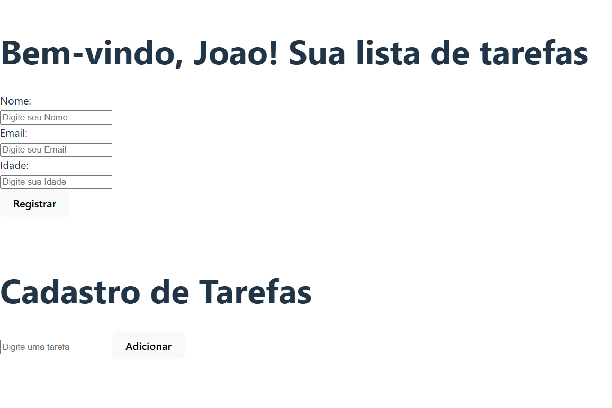

# Projeto Front-End com React e TypeScript

Este projeto é uma aplicação simples de Front-End desenvolvida com React e TypeScript. O objetivo do projeto é praticar o uso de Hooks (como `useState` e `useEffect`), manipulação de formulários, gerenciamento de estado e utilização do `localStorage` para persistir dados. A aplicação consiste em dois componentes principais: cadastro de usuário e cadastro de tarefas.

## Funcionalidades

- **Cadastro de Usuário**:  
  - Exibe um prompt para que o usuário informe seu nome.
  - Armazena o nome no `localStorage` para que seja mantido mesmo após atualizar a página.
  - Permite cadastrar e exibir informações como nome, e-mail e idade.

- **Cadastro de Tarefas**:  
  - Permite adicionar tarefas a uma lista.
  - Exibe a lista de tarefas cadastradas utilizando a função `map`.
  - Persiste as tarefas no `localStorage`, evitando a perda de dados em atualizações.

## Estrutura do Projeto

```
/src
│── /assets
│   ├── screenshot-1.png
│   ├── screenshot-2.png
│── /components
│   ├── Cadastro.tsx
│   ├── Tarefas.tsx
│── /styles
│   ├── global.css
│── App.tsx
│── main.tsx
│── index.html
│── tsconfig.json
```

- **/assets**: Contém as imagens de captura de tela (screenshot-1.png e screenshot-2.png) demonstrando a aplicação.
- **/components**: Contém os componentes principais (`Cadastro.tsx` e `Tarefas.tsx`).
- **/styles**: Contém o arquivo `global.css` com estilos globais para a aplicação.
- **App.tsx**: Componente raiz que integra os componentes de Cadastro e Tarefas.
- **main.tsx**: Ponto de entrada da aplicação onde o React renderiza o App.
- **index.html**: Arquivo HTML principal que abriga a aplicação.
- **tsconfig.json**: Configuração do compilador TypeScript.

## Tecnologias Utilizadas

- **React**: Biblioteca para construção de interfaces de usuário.
- **TypeScript**: Superset do JavaScript com tipagem estática.
- **Hooks**: Uso de `useState` e `useEffect` para gerenciamento de estado e efeitos colaterais.
- **localStorage**: API do navegador utilizada para persistência de dados.

## Screenshots

A seguir, veja algumas capturas de tela da aplicação:



## Como Executar o Projeto

1. **Clone o repositório:**
   ```bash
   git clone https://seu-repositorio.git
   cd nome-do-projeto
   ```

2. **Instale as dependências:**
   ```bash
   npm install
   ```

3. **Execute a aplicação:**
   ```bash
   npm start
   ```
   A aplicação será iniciada e poderá ser acessada em [http://localhost:3000](http://localhost:3000).

## Considerações Finais

Este projeto foi desenvolvido para demonstrar conceitos básicos de React com TypeScript, incluindo manipulação de formulários, gerenciamento de estado com Hooks e persistência de dados com `localStorage`. Ele pode servir como base para projetos mais complexos e para o aprendizado de boas práticas no desenvolvimento de aplicações front-end.
---